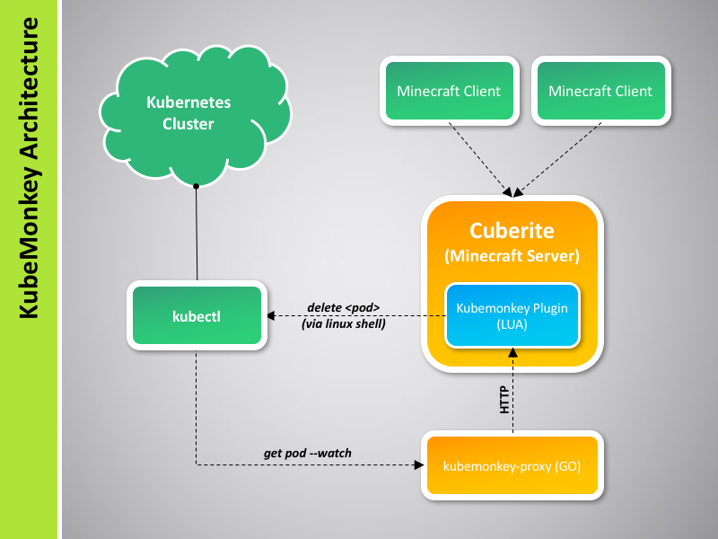

# kubemonkey

## What is it?

Want to be a superhero? Imagine docker containers represented as villagers in Minecraft and zombies trying to kill them - OPS worst nightmare! Expose your containers in your production network on "bring-your-child-to-work-day"! (A labweek project)

## Architecture

## Components

### cuberite (Forked)

Source: https://github.com/masterjk/kubemonkey-cuberite

Extensible Minecraft server that we have forked to include a couple of [changes](https://github.com/masterjk/kubemonkey-cuberite/commits/master):

* Change Zombie to not burn in daylight.
* Expose Monster:SetTarget() to LUA plugin framework.

### kubemonkey-cuberite-plugin

Source: https://github.com/masterjk/kubemonkey-cuberite-plugin

LUA plugin that has an HTTP interface for the `kubemonkey-proxy` to be able to send pods creation/termination events.

### kubemonkey-proxy

Source: https://github.com/masterjk/kubemonkey-proxy

Serves as the Kubernetes-Cuberite proxy plugin (based in GO). It listens for kubernetes pods creation/termination events via `kubectl get pod --watch`, and relays it to `kubemonkey-cuberite-plugin` via HTTP.
